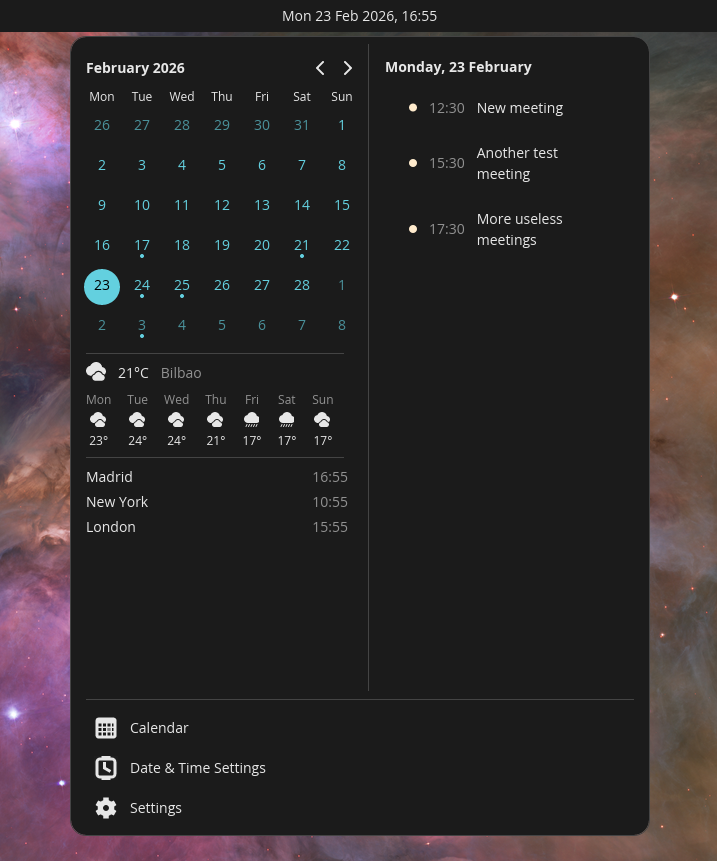
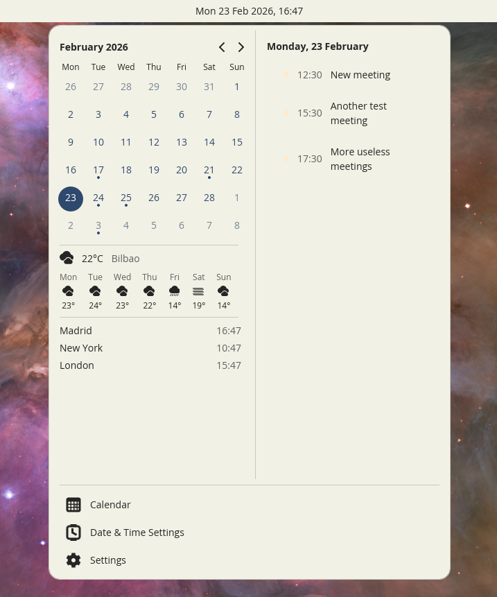

# Calendar & Schedule for COSMIC

An applet for the [COSMIC desktop environment](https://system76.com/cosmic) that displays the current date and time, with a popup showing a calendar grid and your upcoming events, together with weather and up to 3 world clocks.

 


## Features

- **Date and time in your panel** -- Shows the current date and time at a glance, with configurable format
- **Calendar grid** -- Navigate months and see which days have events
- **Day schedule** -- Select a day to see its events side by side with the calendar
- **Weather** -- Current conditions and 4-day forecast for your configured city, powered by Open-Meteo
- **World clocks** -- Display the time in up to 3 cities across different timezones
- **Upcoming events** -- View meetings, appointments, and tasks from your calendars
- **Smart filtering** -- Filter by calendar, all-day events, time range, or acceptance status
- **Auto-refresh** -- Optionally sync calendars from remote servers on a configurable interval
- **Works with Evolution** -- Integrates with all your Evolution Data Server calendars (GNOME Online Accounts, local calendars, etc.)


## Installation

### Flatpak Repository (Recommended)

Add the Flatpak repository to get automatic updates:

```bash
flatpak remote-add --user --if-not-exists calendar-schedule https://bogdart.github.io/calendar-schedule-cosmic/index.flatpakrepo
flatpak install --user calendar-schedule com.bogdart.CalendarSchedule
```

### Flatpak Bundle

Alternatively, download the `.flatpak` bundle from the [Releases page](https://github.com/bogdart/calendar-schedule-cosmic/releases):

```bash
flatpak install --user cosmic-calendar-schedule-x86_64.flatpak
```

### Debian/Ubuntu/Pop!_OS

Download the `.deb` file from the [Releases page](https://github.com/bogdart/calendar-schedule-cosmic/releases):

```bash
sudo apt install ./cosmic-calendar-schedule_*.deb
```

After installing, you should be able to enable it in Settings > Desktop > Panel > Applets.

### Setting Up Calendars

* COSMIC DE doesn't have any native calendar app or way to set up online calendars (though one is [apparently in progress](https://github.com/cosmic-utils/calendar)). You can do this through Evolution or the Online Accounts setting in GNOME.
    * If you're using PopOS, Evolution will probably be easier than using Online Accounts to set up calendars.
* This app is agnostic to what calendar app you use, but it gets its data from EDS (Evolution Data Server).
    * Other, non-EDS calendars (like Thunderbird) won't work as a data source. But you can set up the same calendars in EDS and still open other calendar apps from the applet. The applet will honor whatever calendar app is configured as the system calendar app.
    * The applet reads from cached events. If EDS syncs your online calendars, it will see the updates. You can optionally enable a setting to automatically tell EDS to fetch stuff from online calendars.

### Weather

The applet can show current weather and a 4-day forecast in the popup. To set it up, open the applet settings and search for your city. Weather data is fetched from [Open-Meteo](https://open-meteo.com/) every 30 minutes — no account or API key needed.

### World Clocks

You can add up to 3 world clocks that display below the calendar. Search for a city in the settings to add it. The clocks show the city name and current local time, and respect your system's 12/24-hour format.


## Development

### Building

```bash
just build-release    # Build release binary
just run              # Build and run
just dev              # Build, install, and reload panel
just check            # Run clippy lints
```

### Packaging

#### Debian/Ubuntu (.deb)

Prerequisites: `sudo apt install debhelper devscripts`

```bash
just vendor        # vendor dependencies for offline build
just build-deb     # build .deb package (output in parent directory)
sudo apt install ../cosmic-calendar-schedule_*.deb
```

#### Flatpak

Prerequisites:

```bash
sudo apt install flatpak-builder

# Install Flatpak runtimes and Rust SDK
flatpak remote-add --user --if-not-exists flathub https://flathub.org/repo/flathub.flatpakrepo
flatpak install --user -y flathub org.freedesktop.Platform//24.08 org.freedesktop.Sdk//24.08 org.freedesktop.Sdk.Extension.rust-stable//24.08
```

Build and install:

```bash
just vendor         # vendor dependencies (only needed after Cargo.lock changes)
just build-flatpak  # build .flatpak bundle (output: cosmic-calendar-schedule-x86_64.flatpak)
just install-flatpak  # install locally for testing
```

Or install all build dependencies at once with `just install-build-deps`.

### Translating

Localization uses [Fluent](https://projectfluent.org/). Translation files are in the [i18n](./i18n) directory.

## Acknowledgements

This project is based on [Next Meeting for COSMIC](https://github.com/dangrover/next-meeting-for-cosmic) by Dan Grover, with calendar grid code adapted from [cosmic-applet-time](https://github.com/pop-os/cosmic-applets) by System76. Both projects are licensed under GPL-3.0-only.

Weather data and geocoding provided by [Open-Meteo](https://open-meteo.com/).

## License

GPL-3.0-only
